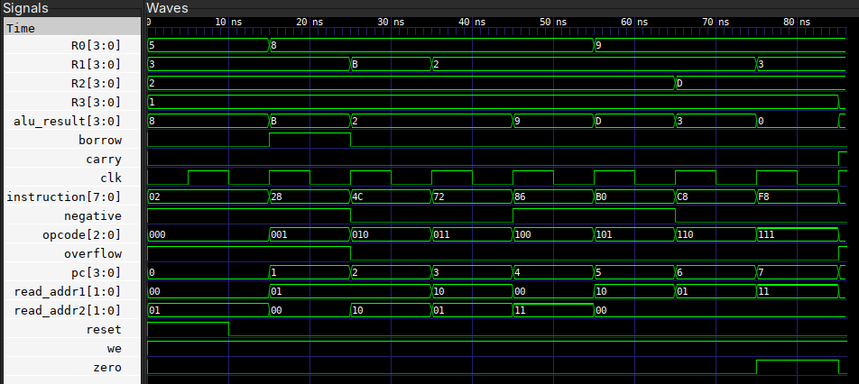

# Verilog Digital Design

A collection of digital design modules and a simple 4-bit CPU implemented in Verilog HDL. The project is developed and verified using Icarus Verilog and GTKWave.

## Project Overview

The project starts with basic combinational building blocks and progressively integrates them into a small processor.
The main design progression is:

```text
Half Adder
    ↓
Full Adder
    ↓
4-bit Ripple Carry Adder

4-bit ALU
    ↓
Register File
    ↓
Datapath

Program Counter
Instruction Memory
Control Unit
    ↓
Simple 4-bit CPU
```
The CPU demonstrates the basic RTL structure of a processor, including instruction fetching, instruction decoding, register operations, ALU execution, and write-back.
---

# Repository Structure
```text
verilog-digital-design/
│
├── half_adder/
│   ├── rtl/
│   │   └── half_adder.v
│   └── testbench/
│       └── half_adder_tb.v
│
├── full_adder/
│   ├── rtl/
│   │   └── full_adder.v
│   └── testbench/
│       └── full_adder_tb.v
│
├── ripple_carry_adder/
│   ├── rtl/
│   │   └── rca_4bit.v
│   └── testbench/
│       └── rca_tb.v
│
├── alu/
│   ├── rtl/
│   │   └── alu_4bit.v
│   └── testbench/
│       ├── alu_tb.v
│       └── alu_edge_tb.v
│
├── register_file/
│   ├── rtl/
│   │   └── register_file.v
│   └── testbench/
│       └── regfile_tb.v
│
├── datapath/
│   ├── rtl/
│   │   └── datapath.v
│   └── testbench/
│       └── datapath_tb.v
│
├── control_unit/
│   ├── rtl/
│   │   └── control_unit.v
│   └── testbench/
│       └── cu_tb.v
│
├── instruction_memory/
│   ├── rtl/
│   │   └── instruction_memory.v
│   └── testbench/
│       └── imem_tb.v
│
├── program_counter/
│   ├── rtl/
│   │   └── pc.v
│   └── testbench/
│       └── pc_tb.v
│
└── cpu/
    ├── rtl/
    │   └── cpu.v
    └── testbench/
        └── cpu_tb.v
```
---
## 1. Half Adder

The half adder adds two 1-bit binary inputs.

### Inputs

| Input | Description |
|:-----:|-------------|
| `a` | Input bit |
| `b` | Input bit |

### Outputs

| Output | Description |
|:------:|-------------|
| `sum` | `a ^ b` |
| `carry` | `a & b` |

### Design

The half adder uses an XOR gate to generate the sum and an AND gate to generate the carry.

```text
              ┌───────────┐
        a ───►│           │
              │    XOR    │────► sum
        b ───►│           │
              └───────────┘

              ┌───────────┐
        a ───►│           │
              │    AND    │────► carry
        b ───►│           │
              └───────────┘
```
---

## 2. Full Adder

The full adder adds two 1-bit binary inputs and an input carry.

### Inputs

| Input | Description |
|:-----:|-------------|
| `a` | First input bit |
| `b` | Second input bit |
| `cin` | Carry input |

### Outputs

| Output | Description |
|:------:|-------------|
| `sum` | Sum output |
| `cout` | Carry output |

### Hierarchical Design

The full adder is constructed using **two half adders and an OR operation**.

```text
                ┌─────────────┐
        a ─────►│  Half Adder │──── s1 ────┐
        b ─────►│     HA1     │            │
                └──────┬──────┘            ▼
                       │ c1          ┌─────────────┐
                       │             │  Half Adder │────► sum
                       └────────────►│     HA2     │
                             cin ───►│             │
                                     └──────┬──────┘
                                            │ c2

                       c1 ─────┐
                               ├── OR ───► cout
                       c2 ─────┘
```

The first half adder generates an intermediate sum and carry. The second half adder adds the input carry to the intermediate sum. The two carry outputs are ORed to produce `cout`.

---

## 3. 4-bit Ripple Carry Adder

The 4-bit ripple carry adder performs binary addition of two 4-bit operands.

### Inputs

| Input | Description |
|:-----:|-------------|
| `a[3:0]` | First 4-bit operand |
| `b[3:0]` | Second 4-bit operand |
| `cin` | Input carry |

### Outputs

| Output | Description |
|:------:|-------------|
| `sum[3:0]` | 4-bit sum |
| `cout` | Final carry output |

### Hierarchical Design

The ripple carry adder is constructed by connecting **four full adders**.

```text
                 ┌─────────┐      ┌─────────┐      ┌─────────┐      ┌─────────┐
a[0] ───────────►│         │      │         │      │         │      │         │
b[0] ───────────►│   FA0   │─c1─► │   FA1   │─c2─► │   FA2   │─c3─► │   FA3   │──► cout
cin ────────────►│         │      │         │      │         │      │         │
                 └────┬────┘      └────┬────┘      └────┬────┘      └────┬────┘
                      │                │                │                │
                    sum[0]           sum[1]           sum[2]           sum[3]
```

Each full adder receives the carry generated by the previous stage.

Therefore:

```text
FA0 → FA1 → FA2 → FA3
```

The carry propagates from the least significant bit to the most significant bit.

### Hierarchy

```text
4-bit Ripple Carry Adder
        │
        ├── Full Adder 0
        │      └── Half Adders
        │
        ├── Full Adder 1
        │      └── Half Adders
        │
        ├── Full Adder 2
        │      └── Half Adders
        │
        └── Full Adder 3
               └── Half Adders
```

Thus, the RCA is built hierarchically from full adders, which are themselves built from half adders.

---

## 4. 4-bit ALU

The 4-bit ALU performs arithmetic and logical operations on two 4-bit operands.

### Inputs

| Input | Description |
|:-----:|-------------|
| `a[3:0]` | First 4-bit operand |
| `b[3:0]` | Second 4-bit operand |
| `opcode[2:0]` | Operation select |

### Outputs

| Output | Description |
|:------:|-------------|
| `result[3:0]` | 4-bit operation result |
| `carry` | Unsigned carry |
| `borrow` | Unsigned borrow |
| `overflow` | Signed two's-complement overflow |
| `zero` | Indicates zero result |
| `negative` | Indicates negative result |

### Instruction Set

| Opcode | Operation |
|:------:|-----------|
| `000` | ADD |
| `001` | SUB |
| `010` | AND |
| `011` | OR |
| `100` | XOR |
| `101` | NOT A |
| `110` | INC A |
| `111` | DEC A |

### Operations

The ALU supports:

- Arithmetic: ADD, SUB, INC, DEC
- Logical: AND, OR, XOR, NOT
- Status flags: carry, borrow, overflow, zero, negative

The arithmetic operations include unsigned carry/borrow detection and signed two's-complement overflow detection.

The `zero` flag is asserted when the result is `0000`, while the `negative` flag follows the most significant bit of the result.

---

## 5. Register File

The register file provides storage for four 4-bit registers.

### Registers

```text
R0
R1
R2
R3
```

### Interface

| Signal | Description |
|--------|-------------|
| `clk` | Clock |
| `reset` | Asynchronous reset |
| `we` | Write enable |
| `write_addr` | Destination register |
| `write_data` | Data written to register |
| `read_addr1` | First read address |
| `read_addr2` | Second read address |
| `read_data1` | First read data |
| `read_data2` | Second read data |

### Architecture

The register file provides:

- Two asynchronous read ports
- One synchronous write port
- Asynchronous reset

```text
                    ┌────────────────────┐
read_addr1 ────────►│                    │────► read_data1
                    │                    │
read_addr2 ────────►│   Register File    │────► read_data2
                    │                    │
write_addr ────────►│                    │
write_data ────────►│                    │
we ────────────────►│                    │
clk ───────────────►│                    │
reset ─────────────►│                    │
                    └────────────────────┘
```

### Reset Values

| Register | Value |
|:--------:|:-----:|
| `R0` | `0101` |
| `R1` | `0011` |
| `R2` | `0010` |
| `R3` | `0001` |

The register file is later connected to the ALU to form the processor datapath.

---

## 6. Datapath

The datapath connects the **Register File** and the **4-bit ALU**.

### Hierarchical Design

```text
                  ┌─────────────────┐
                  │  Register File  │
                  │                 │
read_addr1 ──────►│                 │────► read_data1 ──┐
read_addr2 ──────►│                 │────► read_data2 ──┤
                  │                 │                   │
                  └───────▲─────────┘                   ▼
                          │                       ┌─────────────┐
                          │                       │  4-bit ALU  │
                          │                       │             │
                          └────── result ◄────────│             │
                                                  └──────┬──────┘
                                                         │
                                                   ALU flags
```

The two register-file read ports provide the operands to the ALU.

The ALU generates the result and status flags.

When write enable is asserted, the ALU result is written back to the selected register.

### Datapath Operations

```text
Register File
      │
      ├── Operand A ──┐
      │               │
      └── Operand B ──┤
                      ▼
                   4-bit ALU
                      │
                      ├── Result
                      ├── Carry
                      ├── Borrow
                      ├── Overflow
                      ├── Zero
                      └── Negative
                      │
                      ▼
                 Write Back
                      │
                      ▼
                Register File
```

This creates the basic execute and write-back path of the processor.

---

## 7. Program Counter

The program counter is a 4-bit sequential register used to address the current instruction.

### Interface

| Signal | Description |
|--------|-------------|
| `clk` | Clock |
| `reset` | Asynchronous reset |
| `pc[3:0]` | Current instruction address |

### Operation

On reset:

```text
PC = 0
```

On every rising clock edge:

```text
PC = PC + 1
```

The 4-bit counter wraps around from address `15` to address `0`.

```text
0 → 1 → 2 → 3 → ... → 14 → 15 → 0
```

The program counter provides the address to the instruction memory.

---

## 8. Instruction Memory

The instruction memory stores the instructions executed by the CPU.

The current implementation contains **16 locations of 8-bit instructions**.

### Instruction Format

```text
┌─────────┬──────────┬──────────┬───────┐
│ opcode  │  src1/   │   src2   │unused │
│  [7:5]  │   dest   │   [2:1]  │  [0]  │
│         │   [4:3]  │          │       │
└─────────┴──────────┴──────────┴───────┘
```

| Bits | Field | Description |
|:----:|-------|-------------|
| `[7:5]` | `opcode` | ALU operation |
| `[4:3]` | `src1/dest` | First source and destination register |
| `[2:1]` | `src2` | Second source register |
| `[0]` | unused | Reserved |

### Program

The instruction memory is currently initialized with the following program:

| Address | Instruction | Operation |
|:-------:|:-----------:|-----------|
| `0` | `02` | ADD R0, R1 |
| `1` | `28` | SUB R1, R0 |
| `2` | `4C` | AND R1, R2 |
| `3` | `72` | OR R2, R1 |
| `4` | `86` | XOR R0, R3 |
| `5` | `B0` | NOT R2 |
| `6` | `C8` | INC R1 |
| `7` | `F8` | DEC R3 |

The instruction memory provides the current instruction to the control unit based on the program counter.

---

## 9. Control Unit

The control unit decodes the current 8-bit instruction.

### Inputs

| Input | Description |
|-------|-------------|
| `instruction[7:0]` | Current instruction |

### Outputs

| Output | Description |
|--------|-------------|
| `opcode[2:0]` | ALU operation |
| `read_addr1[1:0]` | First source/destination register |
| `read_addr2[1:0]` | Second source register |
| `we` | Register-file write enable |

### Instruction Decoding

The control unit extracts the fields directly from the instruction:

```text
instruction[7:5] → opcode
instruction[4:3] → read_addr1
instruction[2:1] → read_addr2
```

The decoded control signals are then supplied to the datapath.

### Hierarchy

```text
Instruction
     │
     ▼
┌───────────────┐
│ Control Unit  │
└───────┬───────┘
        │
        ├── opcode
        ├── read_addr1
        ├── read_addr2
        └── write enable
                │
                ▼
             Datapath
```

---

## 10. Simple 4-bit CPU

The final CPU integrates all the previously developed modules.

### CPU Hierarchy

```text
                         ┌──────────────────┐
                         │ Program Counter  │
                         └────────┬─────────┘
                                  │ address
                                  ▼
                         ┌──────────────────┐
                         │ Instruction      │
                         │ Memory           │
                         └────────┬─────────┘
                                  │ instruction
                                  ▼
                         ┌──────────────────┐
                         │  Control Unit    │
                         └────────┬─────────┘
                                  │ control signals
                                  ▼
                         ┌──────────────────┐
                         │     Datapath     │
                         │                  │
                         │  Register File   │
                         │        │         │
                         │        ▼         │
                         │      4-bit ALU   │
                         │        │         │
                         │        ▼         │
                         │    Write Back    │
                         └──────────────────┘
```

### Complete Design Hierarchy

```text
Simple CPU
│
├── Program Counter
│
├── Instruction Memory
│
├── Control Unit
│
└── Datapath
    │
    ├── Register File
    │
    └── 4-bit ALU
```

### Arithmetic Building-Block Hierarchy

The arithmetic modules were developed hierarchically as independent building blocks:

```text
4-bit Ripple Carry Adder
│
├── Full Adder
│   ├── Half Adder
│   └── Half Adder
│
├── Full Adder
│   ├── Half Adder
│   └── Half Adder
│
├── Full Adder
│   ├── Half Adder
│   └── Half Adder
│
└── Full Adder
    ├── Half Adder
    └── Half Adder
```

This hierarchical structure allows each RTL block to be developed and verified independently before integration.

---

## 11. Instruction Execution

The CPU follows the basic instruction flow:

```text
1. Fetch
      │
      ▼
Program Counter
      │
      ▼
Instruction Memory
      │
      │ instruction
      ▼
2. Decode
      │
      ▼
Control Unit
      │
      │ opcode + register addresses
      ▼
3. Execute
      │
      ▼
Register File → ALU
      │
      ▼
4. Write Back
      │
      ▼
Register File
```

The current instruction format uses the `[4:3]` field as both the first source register and the destination register.

Therefore, the datapath connects:

```text
read_addr1 → write_addr
```

for the current instruction set.

---

## 12. Current Program Execution

The instruction memory contains eight instructions.

Starting register values:

| Register | Initial Value |
|:--------:|:-------------:|
| `R0` | `5` |
| `R1` | `3` |
| `R2` | `2` |
| `R3` | `1` |

The CPU executes:

| PC | Instruction | Operation |
|:--:|:-----------:|-----------|
| `0` | `02` | ADD R0, R1 |
| `1` | `28` | SUB R1, R0 |
| `2` | `4C` | AND R1, R2 |
| `3` | `72` | OR R2, R1 |
| `4` | `86` | XOR R0, R3 |
| `5` | `B0` | NOT R2 |
| `6` | `C8` | INC R1 |
| `7` | `F8` | DEC R3 |

After execution:

| Register | Final Value |
|:--------:|:-----------:|
| `R0` | `9` |
| `R1` | `3` |
| `R2` | `13` |
| `R3` | `0` |

The program counter advances to address `8`.

---

## 13. Verification

Each module has its own testbench.

The verification hierarchy follows the same order as the RTL design:

```text
Half Adder
    ↓
Full Adder
    ↓
Ripple Carry Adder
    ↓
ALU
    ↓
Register File
    ↓
Datapath
    ↓
Control Unit
    ↓
Instruction Memory
    ↓
Program Counter
    ↓
Simple CPU
```

The individual testbenches verify the behavior of each module before it is used as part of a higher-level design.

The CPU testbench verifies:

- Instruction fetch
- Instruction decoding
- Register selection
- ALU operation
- Write enable
- ALU result
- Carry
- Borrow
- Overflow
- Zero
- Negative
- Final register state
- Program counter progression

---
## Simulation Waveforms

GTKWave screenshots from the module-level and CPU-level simulations are provided in the `screenshots/` directory.

The screenshots provide visual evidence of signal transitions and functional behavior across the individual modules and the integrated CPU.

### CPU Waveform



---

## 14. Simulation

The project uses:

- Verilog HDL
- Icarus Verilog
- GTKWave
- Git
- GitHub

### Complete CPU Simulation

Compile the CPU and its dependent modules:

```bash
iverilog -o cpu_sim \
    alu/rtl/alu_4bit.v \
    register_file/rtl/register_file.v \
    datapath/rtl/datapath.v \
    control_unit/rtl/control_unit.v \
    instruction_memory/rtl/instruction_memory.v \
    program_counter/rtl/pc.v \
    cpu/rtl/cpu.v \
    cpu/testbench/cpu_tb.v
```

Run the simulation:

```bash
vvp cpu_sim
```

The CPU testbench generates:

```text
cpu_wave.vcd
```

Open the waveform using:

```bash
gtkwave cpu_wave.vcd
```

Waveforms can be used to inspect the PC, instruction, decoded control signals, ALU result, flags, and register activity.

---

## 15. Project Structure

```text
verilog-digital-design/
│
├── half_adder/
├── full_adder/
├── ripple_carry_adder/
├── alu/
├── register_file/
├── datapath/
├── control_unit/
├── instruction_memory/
├── program_counter/
└── cpu/
```

Each module follows the same basic organization:

```text
module/
├── rtl/
│   └── design.v
└── testbench/
    └── module_tb.v
```

This separates the RTL design files from the simulation-only verification code.